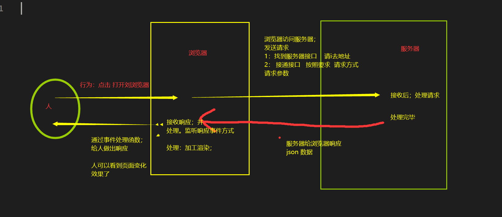

### 交互过程

### 服务器
- ip  找到服务器
- 端口号：找到服务
- /a/b   找到接口；要json 数据

一个【服务器】可以启动【多个服务】，一个服务可以写【多个接口】，每个接口可以【响应数据】，数据格式为xml或者json格式

### 浏览器是如何发送请求
1：通过【请求地址】 找接口
  - 404 没找到 地址错误 或者找到了 没响应
2：按照接口要求接口接通接口
  - 要求一：指定【请求方式】  get post pull delete
  - 要求二：需要【请求参数】  数据格式有所不同，例如： json格式 json 字符串 json 对象  

以上都满足后；接口接通 服务器处理请求  ----> 服务端开发人员的工作

### 如何接收响应并吹里
1：怎么接收？
  1.1 响应内内容；全部放在 XMLHttpRequest 对象中
  1.2 通过监听【响应事件】XMLHttpRequest.onreadystatechange 
  1.3 在响应事件处理函数内部；处理响应数据
    - XMLHttpRequest.status 获取http 状态吗
    - XMLHttpRequest.readyStatus 获取状态
    - XMLHttpRequest.respose 获取【响应体】中数据。（json数据or xml)

2：怎么处理？
  2.1  根据dom 结构；分析页面需要的数据结构
  2.2  将响应数据加工处理。得到.符合页面的数据接哦古
  2.3  通过 事件处理；完成js动态交互

3: 注意事项；
  交互是异步的，事件处理函数 ajax 请求
  响应处理需要等待响应成功；在处理；
   - 1 dom 处理在响应处理函数里面写
   - 2：要么在回掉函数中处理dom,在响应处理函数中【执行回调函数】,并传入实参响应数据；
   -   在回掉函数的方法体中 接收【响应数据】 ，并进行dom 处理

 ### 有没有什么状态是记录请求与响应的过程了
 - 【 0 】 请求装备中  opnen() 之前
 - 【 1 】 发送请求了  send() 之后
 - 【 2 】 服务器处理中 （java开发做的是）
 - 【 3 】 响应发出中    （java开发的工作）
 - 【 4 】响应成功，浏览器接收响应 

 0 1 4 前端开发工作； 2 3服务端开发工作 

### http 状态码
代表了通信中 问题；
- 200 成功
- 400 前端bug
- 404 地址错误85% 或者没有想用15%
- 500 服务器错误

## 数据驱动视图

### 1：保证数据一定是获取到的
- 从Network 看是否发送请求。在preview 看是否有响应信息
【没有数据】常见错误 
 - 404 请求没发送，这是前端问题；url 地址错误
 - 跨域拦截。解决方式 jsop是实现同源策略，获取让服务端人员，给你添加一个请求头
 - 如果服务器没接受到请求，那么一定是前端问题，可能问题：有
  - url错误
  - 参数错误
  - 请求方式错误
  - 请求头问题，少见
  - 解决方式：找到这些东西的来源；一个一个排查；倒着排错 

请求发送了；但是没有数据响应
 - 错误一定发生在服务端。找服务器开发人员；让他给你解决

有数据视图渲染出现问题:
  1:查看响应事件处理函数是否执行
     - 随便在事件处理函数中输出内容
  2：查看是否能浏览器中获取数
     - 直接输出数据查看
  3：查看数据处理是否正确定；json 数的转化
     - 输出数据查看
  4：请求成功后；数据的业务处理；函数是否执行
     - 与请求成功或者失败的判断条件有关
  5：看业务处理函数业务为逻辑是否正确
   - 与 js 数据处理 if for dom 有关
 以上经验丰富的 可以 debug 调试  打断点

 遇到看不懂错误；百度查询 谷歌查询
